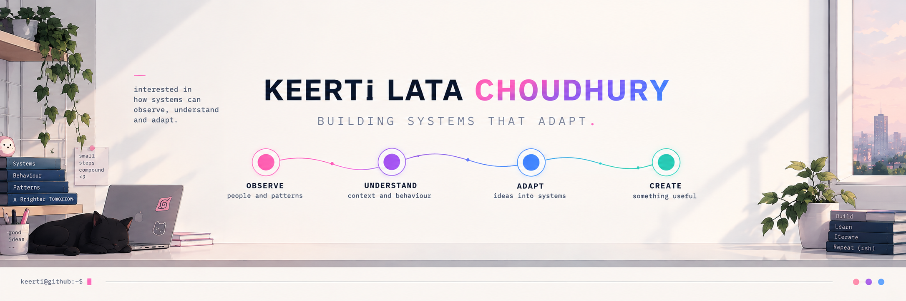

  

---

## 01 / about

I'm a Computer Science student interested in how intelligent systems can understand behaviour, recognize patterns and adapt to changing situations.

A lot of my curiosity starts with a simple question:

> **What if software could observe what's happening, understand the context, and respond instead of simply following rigid rules?**

That question has led me down a few interesting paths:

`behavioural systems` · `human–AI interaction` · `adaptive security` · `interactive software`

---

## 02 / currently exploring

**01 — Behaviour & Patterns**  
Understanding how behavioural signals can reveal meaningful patterns.

**02 — Adaptive Systems**  
Exploring how systems can respond to changing context instead of relying entirely on fixed rules.

**03 — Human–AI Interaction**  
Thinking about how intelligent systems can interact with people in useful and meaningful ways.

---

## 03 / selected projects

A few things I've built while exploring questions about behaviour, interaction and adaptive systems.

 

<table>
<tr>

<td width="50%" valign="top">

### Naruto Desktop Pet

**What if your desktop had a little more personality?**

An interactive desktop companion that reacts to your activity, applications and coding sessions.

`JavaScript` · `Interactive Systems`

[↗ explore the project](https://github.com/Keertilata20/Naruto-Desktop-Pet)

</td>

<td width="50%" valign="top">

### TalkSpace AI

**Can an AI conversation feel more aware of the person behind the message?**

An emotion-aware conversational system exploring more human-centred interaction.

`Python` · `LLMs`

[view project →](https://github.com/Keertilata20/talkspace-ai)

</td>

</tr>

<tr>

<td width="50%" valign="top">

### Behavioural Activity Monitor

**What patterns hide inside the way we work?**

Exploring developer activity, coding rhythms and interaction patterns.

`JavaScript` · `Behavioural Analysis`

[view project →](https://github.com/Keertilata20/Behavioural-Activity-Monitor)

</td>

<td width="50%" valign="top">

### Zero Trust Auth

**What if authentication wasn't just a one-time check?**

A prototype exploring continuous authentication through behavioural signals.

`Security` · `Behavioural Biometrics`

[view project →](https://github.com/Keertilata20/zero-trust-auth)

</td>

</tr>
</table>

 

  

---

## 📊 SYSTEM ANALYTICS

  
  

---

## ⚙️ Tech Stack

###  Languages

  
  

  
  

---

###  Frameworks & Tools

  
  
  
  
  
  
  
  
  
  
  
   

---

###  Domains

  
  
  
  
  
  
  
  

---

## 🌱 Currently Learning

<pre>
+ Machine Learning (deeper concepts & real-world applications)  
+ Security Architecture  
+ Behavioural Biometrics Systems  
</pre>

---

✨ <i>Security shouldn't rely only on trust.  
It should observe, adapt and verify — continuously ! </i>

---

## ☕ Beyond Code

When I'm not building something, I'm usually:

- 🧠 Thinking about how people interact with technology
- 💡 Going down rabbit holes about AI and intelligent systems
- 🐛 Debugging something that definitely worked yesterday

---

  

  

